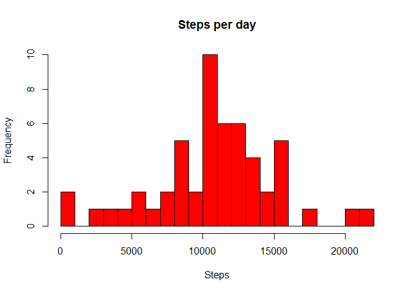
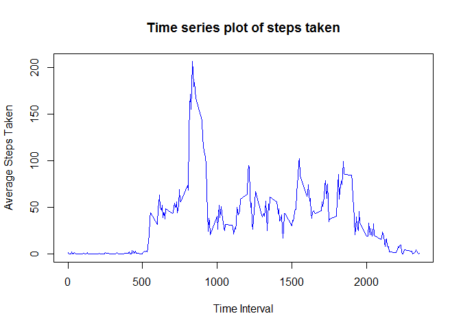
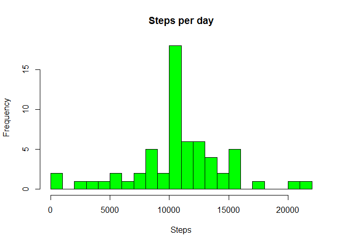

This work is submitted as part of Peer Assessment 1 requirement within
the Reproducible Research course.

Load all the necessary libraries and set the right options

    library(knitr)
    library(data.table)
    library(lattice)

    opts_chunk$set(echo = TRUE, results = 'hold')

Load the activity data and create a data frame with the necessary data
elements

    # Load the data from input file
    fit.data <- read.csv("activity.csv", header = TRUE, sep = ",",
                         colClasses = c("numeric", "character", "numeric"))

    # Extract the date from the text field into a date element
    fit.data$date <- as.POSIXct(fit.data$date, format="%Y-%m-%d")

    # Make it into a data frame also including the weekday from date
    fit.data <- data.frame(date=fit.data$date, 
                           dayofweek=tolower(weekdays(fit.data$date)), 
                           steps=fit.data$steps, 
                           interval=fit.data$interval)

    # Append a daytype column to distinguish between weekday and weekend
    fit.data <- cbind(fit.data, 
                      daytype=ifelse(fit.data$dayofweek %in% c("saturday", "sunday"), 
                                     "weekend", 
                                     "weekday"))

    # Rearrange the columns
    fit.data <- data.frame(date=fit.data$date,
                           interval=fit.data$interval,
                           dayofweek=fit.data$dayofweek,
                           daytype=fit.data$daytype,
                           steps=fit.data$steps)

This is the final data frame that has been put together

    head(fit.data)

    ##         date interval dayofweek daytype steps
    ## 1 2012-10-01        0    monday weekday    NA
    ## 2 2012-10-01        5    monday weekday    NA
    ## 3 2012-10-01       10    monday weekday    NA
    ## 4 2012-10-01       15    monday weekday    NA
    ## 5 2012-10-01       20    monday weekday    NA
    ## 6 2012-10-01       25    monday weekday    NA

<b>What is mean total number of steps taken per day?</b>

Computing aggregate statistics to display

    fit.steps <- aggregate(steps ~ date, data=fit.data, sum, na.rm=TRUE)

1.  Here is a histogram of the number of steps per day

<!-- -->

    hist(fit.steps$steps, 
         main="Steps per day", 
         breaks=25,
         xlab="Steps", 
         ylab="Frequency", 
         col="red")

1.  And some descriptive statistics

Mean:

    fit.steps.mean <- mean(fit.steps$steps)
    cat("Mean:", fit.steps.mean)

    ## Mean: 10766.19

Median:

    fit.steps.median <- median(fit.steps$steps)
    cat("Median:", fit.steps.median)

    ## Median: 10765

<b>What is the average daily activity pattern?</b>

    # Compute the average number of steps

    fit.avgsteps <- aggregate(steps ~ interval, data=fit.data, mean, na.rm=TRUE)

    head(fit.avgsteps)

    ##   interval     steps
    ## 1        0 1.7169811
    ## 2        5 0.3396226
    ## 3       10 0.1320755
    ## 4       15 0.1509434
    ## 5       20 0.0754717
    ## 6       25 2.0943396

1.  Time series plot of the average number of steps taken

<!-- -->

    plot(fit.avgsteps$interval, 
         fit.avgsteps$steps, 
         type="l", 
         col="blue", 
         xlab="Time Interval", 
         ylab="Average Steps Taken", 
         main="Time series plot of steps taken")

1.  When was the maximum number of steps taken?

<!-- -->

    # Locate when the maximum steps happened in the time series

    fit.avgsteps.maxloc <- which(fit.avgsteps$steps == max(fit.avgsteps$steps))
    cat("The max happened at", fit.avgsteps[fit.avgsteps.maxloc,1])

    ## The max happened at 835

<b>Imputing missing values</b>

1.  Calculating and reporting missing values

<!-- -->

    # Count the records with NA
    fit.data.NA <- sum(ifelse(is.na(fit.data$steps),1,0))

    # Report the NA count
    cat("Number of records with NA is", fit.data.NA)

    ## Number of records with NA is 2304

1.  Devising a strategy for filling in missing values

<!-- -->

    # Find the missing indices
    fit.data.missing <- is.na(fit.data$steps)

    # Create a copy of the original dataset
    fit.data.imputed <- fit.data

    # Assign the mean value for the steps element in the table for all those indices
    # Using a simple approximation for steps per interval from the daily averages
    fit.data.imputed[fit.data.missing,"steps"] <- fit.steps.mean / (24*12)

1.  Create a new data set with the missing data filled in

<!-- -->

    # Since we created a copy in the earlier step 
    # it now becomes our new dataset with missing filled in

    head(fit.data.imputed)

    # Confirming that there are no missing values

    cat("Missing values", sum(ifelse(is.na(fit.data.imputed$steps),1,0)))

    ##         date interval dayofweek daytype   steps
    ## 1 2012-10-01        0    monday weekday 37.3826
    ## 2 2012-10-01        5    monday weekday 37.3826
    ## 3 2012-10-01       10    monday weekday 37.3826
    ## 4 2012-10-01       15    monday weekday 37.3826
    ## 5 2012-10-01       20    monday weekday 37.3826
    ## 6 2012-10-01       25    monday weekday 37.3826
    ## Missing values 0

1.  Reporting with histogram and descriptive statistics

Computing aggregate statistics to display

    # Aggregated for each day
    fit.steps.imputed <- aggregate(steps ~ date, data=fit.data.imputed, sum, na.rm=TRUE)

    # Draw the histogram
    hist(fit.steps.imputed$steps, 
         main="Steps per day", 
         breaks=25,
         xlab="Steps", 
         ylab="Frequency", 
         col="green")

Calculate the mean and median

Mean:

    fit.steps.imputed.mean <- mean(fit.steps.imputed$steps)
    cat("Mean:", fit.steps.imputed.mean)

    ## Mean: 10766.19

Median:

    fit.steps.imputed.median <- median(fit.steps.imputed$steps)
    cat("Median:", fit.steps.imputed.median)

    ## Median: 10766.19

Comparison of mean and median after imputing values for missing

    cat("Mean in the initial dataset:", fit.steps.mean, 
        " but after imputing:", fit.steps.imputed.mean)
    cat("\nMedian in the initial dataset:", fit.steps.median, 
        " but after imputing:", fit.steps.imputed.median)

    ## Mean in the initial dataset: 10766.19  but after imputing: 10766.19
    ## Median in the initial dataset: 10765  but after imputing: 10766.19

After filling in for missing values it can be seen that the mean remains
unchanged but the median is now same as the mean. This is expected as
the initial mean calculation ignored missing values and the filling in
was done with the mean value. However, as for the median, with all the
NA now taking value equal to the mean, it looks like the median value is
now same as the mean.

<b>Differences between weekdays and weekends</b>

1.  New factor variable for telling "weekday" vs "weekend"

<!-- -->

    head(fit.data.imputed)
    cat("The \"daytype\" column provides the info if its a weekday or weekend")

    ##         date interval dayofweek daytype   steps
    ## 1 2012-10-01        0    monday weekday 37.3826
    ## 2 2012-10-01        5    monday weekday 37.3826
    ## 3 2012-10-01       10    monday weekday 37.3826
    ## 4 2012-10-01       15    monday weekday 37.3826
    ## 5 2012-10-01       20    monday weekday 37.3826
    ## 6 2012-10-01       25    monday weekday 37.3826
    ## The "daytype" column provides the info if its a weekday or weekend

1.  Make a panel plot containing a time series plot

<!-- -->

    # Compute the time series
    fit.avgsteps.daytype <- aggregate(fit.data.imputed$steps,
                                      by=list(fit.data.imputed$daytype,
                                              fit.data.imputed$dayofweek,
                                              fit.data.imputed$interval),
                                      mean)

    head(fit.avgsteps.daytype)

    # Rename the attributes
    names(fit.avgsteps.daytype) <- c("daytype", "weekday", "interval", "mean")

    # Plot the data

    xyplot(mean ~ interval | daytype, fit.avgsteps.daytype, 
           type="l", 
           lwd=1, 
           xlab="Interval", 
           ylab="Number of steps", 
           layout=c(1,2))

    ##   Group.1  Group.2 Group.3        x
    ## 1 weekday   friday       0 8.307244
    ## 2 weekday   monday       0 9.418355
    ## 3 weekend saturday       0 4.672825
    ## 4 weekend   sunday       0 4.672825
    ## 5 weekday thursday       0 9.375844
    ## 6 weekday  tuesday       0 0.000000
